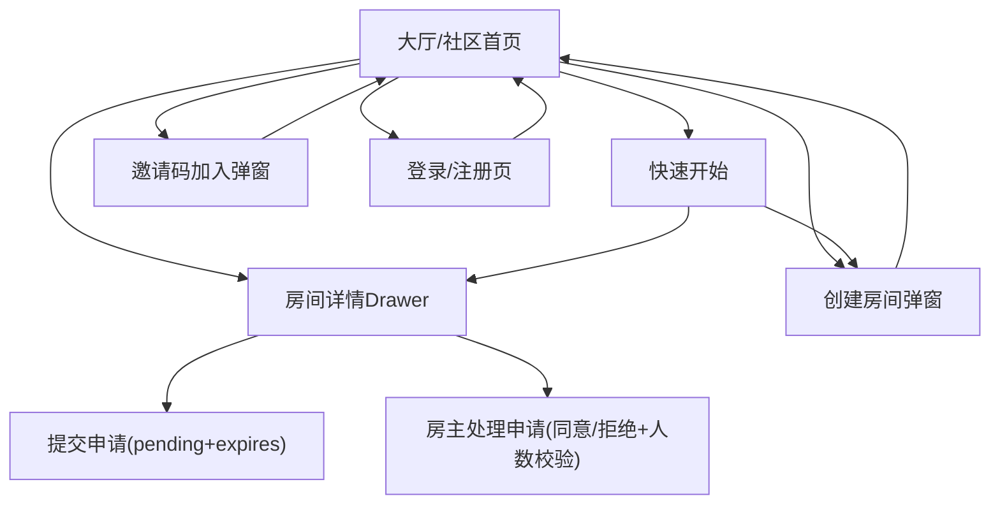

## 1. Product Overview

“大厅/社区首页”用于展示社区实时概览，并提供公开房间的浏览与加入入口。
你可以在同一页完成：查看实时统计、浏览公开房间、发起加入申请、创建房间或通过邀请码加入。

## 2. Core Features

### 2.1 User Roles

| 角色      | 注册/登录方式          | 核心权限                       |
| ------- | ---------------- | -------------------------- |
| 游客(未登录) | 无                | 可查看大厅统计与公开房间列表；加入/创建时被引导登录 |
| 登录用户    | Supabase Auth 登录 | 可申请加入房间；可创建房间；可通过邀请码加入     |
| 房间房主    | 创建房间自动成为         | 可处理加入申请（同意/拒绝）             |

### 2.2 Feature Module

我们的“大厅/社区首页”需求由以下页面组成：

1. **大厅/社区首页**：顶部实时统计（含刷新频率策略）；公开房间列表（含房间状态联动）；房间详情 Drawer（含交互规范与房主处理申请）；加入申请规则（过期/上限/冷却）；人数限制规则；快速开始按钮；创建房间/邀请码加入入口。
2. **登录/注册页**：当你尝试创建/加入/快速开始但未登录时，用于完成认证并按 redirect 参数回跳并继续意图。

### 2.3 Page Details

| Page Name | Module Name | Feature description                                                                                            |
| --------- | ----------- | -------------------------------------------------------------------------------------------------------------- |
| 大厅/社区首页   | 顶部实时统计      | 展示在线人数/公开房间数/与你相关的待处理申请数；按“刷新频率方案”更新并显示“最近更新时间”；失败时支持重试                                                        |
| 大厅/社区首页   | 公开房间列表      | 展示公开房间（名称、简介、成员数/上限、房主、活跃时间）；支持空态/错误态/分页或无限加载；与房间状态联动（成员数变化、已满、你的申请状态）                                         |
| 大厅/社区首页   | 快速开始        | 点击后按规则快速进入：优先打开一个“可加入且未满”的推荐公开房间并聚焦加入区；若无可加入房间则引导一键创建默认房间；未登录则跳转登录并携带 intent                                   |
| 大厅/社区首页   | 房间详情 Drawer | 打开/关闭/遮罩/键盘操作符合 Drawer 规范；展示房间详情、人数限制提示、你的状态与可执行动作；状态变化时与列表/统计实时联动                                             |
| 大厅/社区首页   | 加入申请（规则）    | 提交申请并进入 pending；支持申请过期（到期后视为无效并提示重新申请）；限制重复申请与频率：同一房间同一用户同一时刻仅允许 1 个有效 pending；被拒后进入冷却期不可再次申请；达到申请上限时给出明确提示    |
| 大厅/社区首页   | 申请处理（房主）    | 房主查看 pending 列表并同意/拒绝；同意时二次校验人数上限（已满则拒绝同意并提示原因）；处理结果推动申请人/列表/统计联动更新                                            |
| 大厅/社区首页   | 邀请码加入（规则）   | 校验邀请码（不存在/过期/次数用尽/房间已满）；校验通过后加入并更新成员数；失败时不消耗次数且给出原因                                                            |
| 大厅/社区首页   | 创建房间        | 创建房间时填写人数上限；创建成功后成为房主并在列表中可见；默认可生成邀请码（若产品已支持）                                                                  |
| 大厅/社区首页   | 回跳与继续意图     | 当你被引导去登录/注册时，携带 redirect 与 intent（join/apply/invite/quickstart/create）参数；登录成功后回到大厅并自动恢复之前动作（例如自动打开对应房间 Drawer） |
| 登录/注册页    | 认证与回跳       | 使用 Supabase Auth 完成登录/注册；读取 redirect 与 intent 参数并回跳大厅；若参数缺失则默认回到 /community                                    |

## 3. Core Process

### 3.1 登录用户：房间状态联动与加入申请流

1. 你在大厅点击某房间“查看/加入”，打开房间 Drawer。
2. 系统加载并展示你的状态：已加入 / 待审核（未过期）/ 已拒绝（是否冷却中）/ 可申请。
3. 若房间已满：入口置灰并提示“人数已满”，不允许提交申请/不消耗邀请码次数。
4. 若你提交申请：写入 pending（带 expires\_at）；列表卡片与顶部统计同步显示“待审核/待处理”。
5. 若 pending 到期：状态视为过期并提示“申请已过期，请重新申请”（必要时触发一次状态刷新）。
6. 若房主同意：二次校验房间人数上限；通过则你成为成员并联动更新成员数、列表徽标与统计。
7. 若房主拒绝：进入冷却期（cooldown），冷却结束前不允许再次申请并给出倒计时提示。

### 3.2 快速开始流

1. 你点击“快速开始”。
2. 若存在可加入且未满的推荐公开房间：自动打开该房间 Drawer 并聚焦加入区。
3. 若不存在可加入房间：引导你一键创建默认房间（含默认人数上限），创建成功后自动进入房主视角。

### 3.3 未登录用户：redirect + intent 回跳

你可浏览统计与房间列表；当你点击“创建/加入/邀请码加入/快速开始”时会跳转登录/注册，并携带 `redirect` 与 `intent`（以及 roomId/code 等）参数；登录成功后回到大厅并恢复之前动作。

