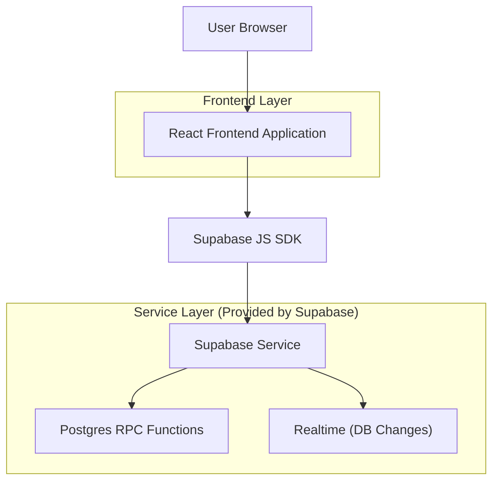
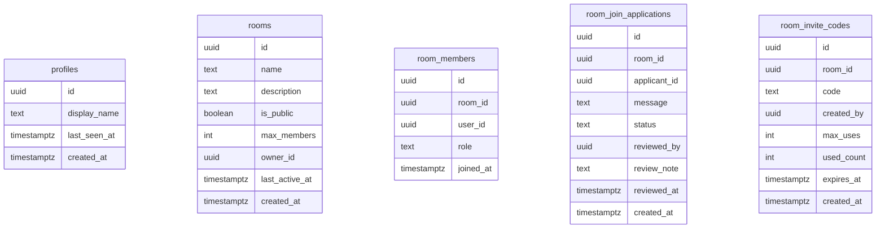

## 1.Architecture design


## 2.Technology Description
- Frontend: React@18 + TypeScript + tailwindcss@3
- Backend: None
- BaaS: Supabase（Auth + Postgres + Realtime）

## 3.Route definitions
| Route | Purpose |
|-------|---------|
| /community | 大厅/社区首页：实时统计、公开房间列表（状态联动）、快速开始、房间 Drawer、创建/邀请码加入、加入申请（过期/上限/冷却）、人数限制 |
| /login?redirect=/community&intent=... | 登录/注册：未登录时完成认证，并按 redirect/intent 回跳继续动作 |

## 6.Data model(if applicable)

### 6.1 Data model definition


### 6.2 Data Definition Language
> 说明：为简化早期开发，不使用物理外键约束；用逻辑外键（room_id/user_id）在应用层保证一致性。

Profiles（profiles）
```sql
CREATE TABLE profiles (
  id UUID PRIMARY KEY,
  display_name TEXT NOT NULL,
  last_seen_at TIMESTAMPTZ,
  created_at TIMESTAMPTZ NOT NULL DEFAULT NOW()
);

GRANT SELECT ON profiles TO anon;
GRANT ALL PRIVILEGES ON profiles TO authenticated;
```

房间（rooms）
```sql
CREATE TABLE rooms (
  id UUID PRIMARY KEY DEFAULT gen_random_uuid(),
  name TEXT NOT NULL,
  description TEXT,
  is_public BOOLEAN NOT NULL DEFAULT TRUE,
  max_members INTEGER NOT NULL DEFAULT 50,
  member_count INTEGER NOT NULL DEFAULT 0,
  owner_id UUID NOT NULL,
  last_active_at TIMESTAMPTZ,
  created_at TIMESTAMPTZ NOT NULL DEFAULT NOW()
);

CREATE INDEX idx_rooms_public_created_at ON rooms(is_public, created_at DESC);
CREATE INDEX idx_rooms_public_not_full ON rooms(is_public, member_count, max_members);

GRANT SELECT ON rooms TO anon;
GRANT ALL PRIVILEGES ON rooms TO authenticated;
```

成员（room_members）
```sql
CREATE TABLE room_members (
  id UUID PRIMARY KEY DEFAULT gen_random_uuid(),
  room_id UUID NOT NULL,
  user_id UUID NOT NULL,
  role TEXT NOT NULL DEFAULT 'member' CHECK (role IN ('owner','member')),
  joined_at TIMESTAMPTZ NOT NULL DEFAULT NOW()
);

CREATE UNIQUE INDEX uniq_room_members_room_user ON room_members(room_id, user_id);
CREATE INDEX idx_room_members_room_id ON room_members(room_id);
CREATE INDEX idx_room_members_user_id ON room_members(user_id);

GRANT SELECT ON room_members TO anon;
GRANT ALL PRIVILEGES ON room_members TO authenticated;
```

加入申请（room_join_applications）
```sql
CREATE TABLE room_join_applications (
  id UUID PRIMARY KEY DEFAULT gen_random_uuid(),
  room_id UUID NOT NULL,
  applicant_id UUID NOT NULL,
  message TEXT,
  status TEXT NOT NULL DEFAULT 'pending' CHECK (status IN ('pending','approved','rejected','cancelled','expired')),
  expires_at TIMESTAMPTZ NOT NULL,
  cooldown_until TIMESTAMPTZ,
  reviewed_by UUID,
  review_note TEXT,
  reviewed_at TIMESTAMPTZ,
  created_at TIMESTAMPTZ NOT NULL DEFAULT NOW()
);

CREATE INDEX idx_room_apps_room_status_created ON room_join_applications(room_id, status, created_at DESC);
CREATE INDEX idx_room_apps_applicant_created ON room_join_applications(applicant_id, created_at DESC);

-- 安全：申请记录仅对登录用户可读（由 RLS/权限控制），避免 anon 枚举
GRANT ALL PRIVILEGES ON room_join_applications TO authenticated;
```

邀请码（room_invite_codes）
```sql
CREATE TABLE room_invite_codes (
  id UUID PRIMARY KEY DEFAULT gen_random_uuid(),
  room_id UUID NOT NULL,
  code TEXT NOT NULL,
  created_by UUID NOT NULL,
  max_uses INTEGER NOT NULL DEFAULT 1,
  used_count INTEGER NOT NULL DEFAULT 0,
  expires_at TIMESTAMPTZ,
  created_at TIMESTAMPTZ NOT NULL DEFAULT NOW()
);

CREATE UNIQUE INDEX uniq_room_invite_code ON room_invite_codes(code);
CREATE INDEX idx_room_invite_room_id ON room_invite_codes(room_id);

-- 安全：邀请码不对 anon 开放读权限
GRANT ALL PRIVILEGES ON room_invite_codes TO authenticated;
```

### 加入申请/审批/邀请码加入（建议 RPC，保证原子性）
> 说明：不引入独立后端服务；用 Supabase Postgres Function（RPC）封装写入，避免并发下的“人数已满仍被加入”“冷却绕过”等问题。

**1) 申请加入（apply_to_room）**
- 校验：未加入该房间、房间未满、无未过期 pending、未处于冷却期、未超过申请上限（例如：你在 24h 内最多提交 N 次申请，N 作为可配置常量）。
- 写入：`INSERT room_join_applications (..., status='pending', expires_at=NOW()+interval '48 hours')`。

**2) 房主审批（review_room_application）**
- 同意：再次校验房间未满 → `UPDATE ... status='approved' ...` → `INSERT room_members ...` → `UPDATE rooms SET member_count = member_count + 1`。
- 拒绝：`UPDATE ... status='rejected', cooldown_until = NOW()+interval 'X minutes/hours'`。

**3) 邀请码加入（consume_invite_code）**
- 校验：邀请码存在、未过期、未达 max_uses、房间未满；成功才递增 used_count 并写入成员与 member_count。

**4) 统计聚合（get_community_stats）**
- 一次 RPC 返回顶部统计需要的 3 个数值，减少多次 round-trip。

### 大厅顶部“实时统计”建议口径
- 在线人数：基于 `profiles.last_seen_at`（例如近 2 分钟内视为在线）做 `COUNT`。
- 公开房间数：`SELECT COUNT(*) FROM rooms WHERE is_public = true`。
- 待处理申请数（与你相关）：若你是房主，统计你名下房间的 pending 申请数；若你是普通用户，统计你自己的 pending 申请数。

> 实时刷新方式：
> - 状态联动：客户端订阅 `rooms` / `room_members` / `room_join_applications` 的变更事件（Realtime），收到事件后“增量更新列表卡片 + Drawer + 顶部统计”。
> - 统计刷新频率方案（建议默认）：
>   - 顶部统计：前台可见时每 30s 拉取一次（或触发式刷新），后台/隐藏标签页降频到 2–5min；错误时指数退避。
>   - 房间列表：Realtime 做增量推送；同时每 60s 做一次 reconcile（重新拉取当前分页）防止遗漏。
>   - 在线人数：客户端每 60s 心跳更新 `profiles.last_seen_at`；统计端按 30s 轮询或 RPC 聚合。
> - 关键写入建议走 RPC（保证原子性与人数上限/冷却/过期检查）。